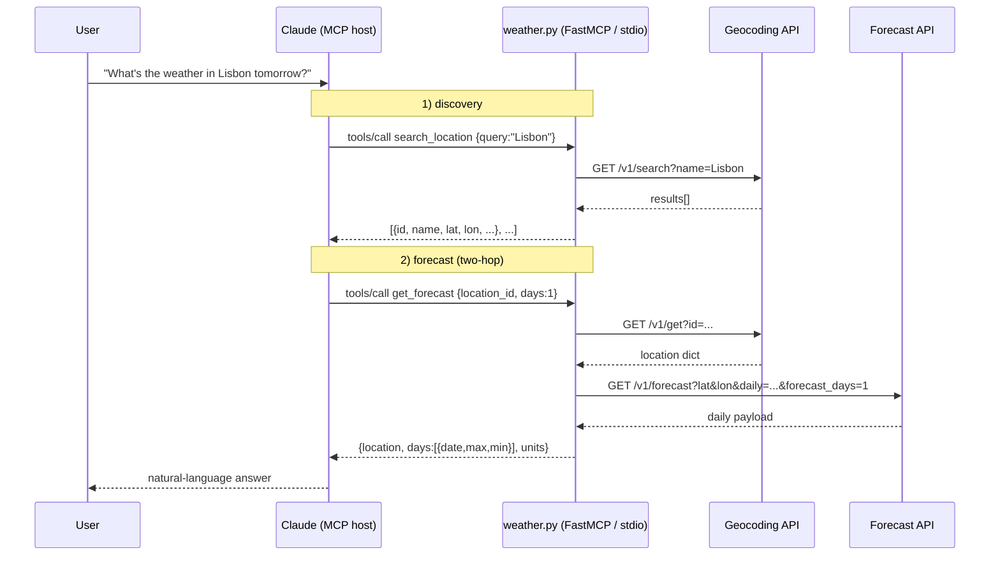

# Week 01 — MCP Weather Server (CCAF Study Notes)

> **Goal of this week's notes**
> Build a theoretical foundation for what an MCP server *is*, then map every concept onto the code shipped so far in this repo. By the end you should be able to (a) draw the request flow on a whiteboard, (b) explain why each architectural decision was made, and (c) answer the self-check questions at the bottom without re-reading the source.

---

## Part I — MCP Theory

### 1. What is MCP?

The **Model Context Protocol (MCP)** is an open protocol that lets a host application (an LLM client such as Claude Desktop, Claude Code, or any LLM agent) talk to external **servers** that expose capabilities. It is built on top of **JSON-RPC 2.0** — a stateless, message-oriented RPC format where every message is a JSON object carrying a `method`, `params`, and an `id`.

MCP standardizes three kinds of capability a server can expose:

| Primitive | What it is | Example in this repo |
|-----------|------------|----------------------|
| **Tool** | A function the model can call to *act*. Has a JSON Schema for its inputs and returns structured output. | `search_location`, `get_forecast`, `get_current` |
| **Resource** | Read-only data the model can pull into context (files, DB rows, URLs). | `config://units`, `config://supported_regions` |
| **Prompt** | A reusable prompt template the host can surface to the user. | `trip_weather_briefing` |

For the CCAF, remember the slogan: **"Resources give the model knowledge; tools give it agency; prompts give it structure."**

### 2. Client / Server / Transport

```
┌──────────────┐      JSON-RPC 2.0      ┌──────────────┐
│  MCP Host    │ ◄────────────────────► │  MCP Server  │
│  (Claude)    │     over a TRANSPORT   │  (this repo) │
└──────────────┘                        └──────────────┘
```

The **transport** is the wire. MCP defines two main transports:

- **stdio** — the server is launched as a child process; messages flow over stdin/stdout. Ideal for local tools, fast, no network exposure. **This repo uses stdio.**
- **HTTP + SSE / Streamable HTTP** — for remote servers, multi-client scenarios, or hosting on the web.

### 3. Tool lifecycle

1. **Registration** — at server startup the server records which tools exist, their parameter schemas, and their handler functions.
2. **Discovery** — the client sends `tools/list`. The server replies with the catalogue (name + JSON Schema + description).
3. **Invocation** — the client (driven by the model) sends `tools/call` with `{name, arguments}`. The server runs the handler.
4. **Result** — the server returns either a structured result or an error.

The model never sees the Python — it only sees the *schema* and the *return value*. So your type hints and your output shape are part of the model's contract.

### 4. FastMCP

`FastMCP` is the high-level Python library shipped with the official `mcp` package. It removes JSON-RPC boilerplate:

- `mcp = FastMCP("name")` creates a server.
- `@mcp.tool()` registers an async (or sync) function as a tool. The function's **type hints become the JSON Schema** of `arguments`; its **docstring becomes the tool's `description`**; its **return value** becomes the result.
- `@mcp.resource()` registers read-only data by URI.
- `@mcp.prompt()` registers a reusable prompt template.
- `mcp.run(transport="stdio")` starts the event loop.

**Why this matters for Claude.** When Claude Code or Claude Desktop is configured with this server, it auto-discovers the tools, resources, and prompts and can use them mid-conversation. The model doesn't need to know it's calling Open-Meteo; it only sees `get_forecast(location_id, days)` and the surrounding host-facing metadata.

---

## Part II — Project Recap (theory mapped to code)

### Repo layout

```
mcp-weather-server/
├── weather.py          # thin entrypoint shim
├── mcp_weather_server/
│   ├── weather.py      # FastMCP server, tools, prompts, resources
│   └── data/
│       └── supported_regions.json
├── pyproject.toml      # deps: mcp[cli], httpx, pytest, pytest-asyncio
├── tests/
│   ├── conftest.py     # MockAsyncClient fixture (monkeypatches httpx)
│   └── test_weather.py # 19 test functions (21 pytest items)
└── README.md
```

### Server bootstrap (theory: §2 transport, §4 FastMCP)

```python
# weather.py
from mcp_weather_server.weather import *

if __name__ == "__main__":
    main()
```

```python
# mcp_weather_server/weather.py
from mcp.server.fastmcp import FastMCP
mcp = FastMCP("weather")

def main():
    mcp.run(transport="stdio")

if __name__ == "__main__":
    main()
```

The shim just imports the package module and hands off to its `main()`.

### Prompts and resources

This repo now exposes all three MCP primitives:

- `trip_weather_briefing(destination, days)` is a prompt template, not a tool. It returns a reusable instruction set that tells the host how to chain `search_location` and `get_forecast`.
- `config://units` is a resource for the server's unit defaults.
- `config://supported_regions` is a resource backed by `mcp_weather_server/data/supported_regions.json`, loaded through `importlib.resources`.

The pattern matters: tools act, resources inform, prompts shape the conversation.

### Tool descriptions: the docstring **is** the model's instruction manual

When FastMCP builds the schema returned by `tools/list`, it pulls each tool's `description` straight from the function's **docstring**. The model never sees your Python — but it *does* see this text, and uses it to decide **which tool to call and when**. Treat docstrings as prompt engineering, not developer documentation.

Look at the three tools in this repo:

```python
"""Resolve an ambiguous place name to canonical location IDs.
Use this BEFORE get_forecast or get_current. Returns matches with
state/country/coords for disambiguation.
Do NOT use to retrieve weather — only resolves names to IDs."""
```

```python
"""Return a 1-7 day forecast for a known location_id.
Requires a location_id from search_location. For current
conditions, use get_current instead."""
```

```python
"""Return weather conditions RIGHT NOW for a known location_id.
Requires a location_id from search_location. For future
conditions, use get_forecast instead."""
```

Three theoretical patterns are at work here:

1. **Ordering hints** — `Use this BEFORE…` and `Requires a location_id from search_location` teach the model the *call sequence*. Without these, the model would try to pass `"Lisbon"` directly into `get_forecast`.
2. **Negative scope** — `Do NOT use to retrieve weather — only resolves names to IDs.` Negative instructions stop the model from over-using a tool. Especially effective when two tools are superficially similar.
3. **Sibling cross-reference** — `For current conditions, use get_current instead.` and `For future conditions, use get_forecast instead.` Each tool *points to its sibling* so the model can disambiguate. This is how you prevent it from picking the wrong one of a pair.

**CCAF takeaway.** A FastMCP tool's contract has four model-visible parts: **name** (the function name), **input schema** (from type hints), **description** (from the docstring), **return value**. Spend disproportionate effort on the description — it's the lever that controls *whether* the tool gets called at all.

### The three tools

#### 2.1 `search_location(query)` — discovery

```python
@mcp.tool()
async def search_location(query: str) -> list[dict[str, Any]] | str:
    """Resolve an ambiguous place name to canonical location IDs. ..."""
    ...
    matches.append(_normalize_location(location, id_key="id"))
    return matches
```

- **Why it exists.** The user types "Lisbon" — the model needs an `id` it can pass to other tools. This is the *entry point* of the location pipeline.
- **External call.** `GET https://geocoding-api.open-meteo.com/v1/search?name=...&count=10&language=en`.
- **Output shape.** A list of dicts each containing `id`, `name`, `latitude`, `longitude`, `timezone`, `country`, `admin1`, `feature_code`. Note the field is **`id`** here, not `location_id` — see *Architectural Evolution* below.
- **Failure modes.** Blank query → friendly string. Network error → `"Unable to search locations."` Returning a string instead of throwing keeps the model's experience deterministic.

#### 2.2 `get_forecast(location_id, days=5)` — daily forecast

```python
@mcp.tool()
async def get_forecast(location_id: int, days: int = 5) -> dict[str, Any] | str:
    """Return a 1-7 day forecast for a known location_id. ..."""
    if not isinstance(location_id, int) or location_id <= 0: ...
    if not isinstance(days, int) or days < 1 or days > 7: ...

    location = await _resolve_location(location_id)            # ① geocoding lookup
    forecast_data = await _fetch_forecast(                     # ② forecast fetch
        location["latitude"], location["longitude"], days,
    )
```

- **Two-hop pattern.** First resolve the id to coordinates, then call the forecast API. This is the clearest example of the *id-first* architecture.
- **Constants.** `FORECAST_DAILY_FIELDS = "temperature_2m_max,temperature_2m_min"`.
- **Output.** `{location, days: [...], units}` where each day has `date`, `temperature_2m_max`, `temperature_2m_min`.
- **Bounds.** `1 <= days <= 7` is enforced because Open-Meteo's free tier caps the range and we want to fail fast at the tool boundary.

#### 2.3 `get_current(location_id)` — real-time

```python
@mcp.tool()
async def get_current(location_id: int) -> dict[str, Any] | str:
    """Return weather conditions RIGHT NOW for a known location_id. ..."""
    location = await _resolve_location(location_id)
    current_data = await _fetch_current(location["latitude"], location["longitude"])
```

- Uses the **same forecast endpoint** but with `current=...` instead of `daily=...`.
- Seven fields are fetched: `temperature_2m`, `apparent_temperature`, `relative_humidity_2m`, `wind_speed_10m`, `wind_direction_10m`, `wind_gusts_10m`, `weather_code`.
- The `weather_code` is a **WMO code** (integer mapping to a textual condition like "clear sky" / "fog" / "thunderstorm"). The model can interpret it directly.

### Internal helpers

| Helper | Purpose |
|--------|---------|
| `_load_supported_regions()` | Loads the JSON-backed region list via `importlib.resources`. |
| `_first_location(payload)` | Defensively pull the first hit from either `{"results":[...]}` or a plain dict — the geocoding API returns both shapes depending on endpoint. |
| `_normalize_location(loc, id_key=...)` | Project the raw API dict onto a stable shape. Configurable `id_key` is the keystone of the architectural evolution below. |
| `_resolve_location(id)` | Async `id → location dict` lookup. Used by both id-based tools. |
| `_fetch_forecast(lat, lon, days)` | Daily forecast HTTP call. |
| `_fetch_current(lat, lon)` | Current conditions HTTP call. |

### Architectural evolution (the "why" behind each commit)

The repo's git history is itself a small lesson in API design. Read in order:

1. **Initial forecast tool** took raw `(latitude, longitude)`. Simple, but pushes geocoding onto the *caller* (the model) — bad: every conversation has to re-geocode.
2. **`feat: refactor forecast to location ids` (c39bc90).** Tool surface becomes `(location_id, days)`. `_resolve_location` is born. Now the model has a **stable, cacheable identifier** instead of float coordinates that drift per source.
3. **`feat: add location search tool` (19af177).** A discovery endpoint is required so the model can *get* an id in the first place. `search_location` is added.
4. **`feat: add current weather conditions` (fa89f5b).** The id-resolution pattern is reused — proof the abstraction is paying off. `CURRENT_FIELDS` is centralised.
5. **`feat: align search_location output with canonical id matches` (4d43e29).** A subtle but important fix: `search_location` originally returned `location_id` while the upstream API calls the field `id`. The `id_key` parameter on `_normalize_location` lets us emit `id` from search (matching Open-Meteo's wire format) while still using `location_id` internally where that name reads better. This keeps the model's mental model and the API's mental model aligned.

**Theory takeaway.** A good MCP tool surface is **stable, normalized, and forgiving**. Validate at the boundary, return strings (not exceptions) for user-visible errors, and keep field names consistent across the surface.

---

## Part III — Request flow diagram



The same diagram applies to `get_current`, except the second hop is `?current=...` instead of `?daily=...` and the response carries a `current` block.

---

## Part IV — Testing notes

The test suite (`tests/test_weather.py`, 19 test functions / 21 pytest items) demonstrates three patterns worth internalizing:

- **`MockAsyncClient` queues responses in order.** Because `get_forecast` and `get_current` make *two* HTTP calls (resolve, then fetch), each test must enqueue exactly two mocked responses in the correct order. If you forget the resolve response, the test reveals the two-hop architecture immediately.
- **`pytest-asyncio`** lets us `await` the tool functions directly. Tools are just coroutines; `@mcp.tool()` doesn't wrap them in anything that breaks direct invocation. This is *why* tools should remain pure async functions: they're trivially testable.
- **Prompt and resource coverage belongs in the same suite.** The tests now assert registration, metadata, rendering, and JSON text for `trip_weather_briefing`, `config://units`, and `config://supported_regions`, so the docs and host-facing surface stay in sync.

Coverage at a glance:
- 4 tests on `search_location` (happy, blank, empty, error)
- 4 tests on `get_forecast` (happy, days>7, missing location, upstream error)
- 4 tests on `get_current` (happy, invalid id, missing location, upstream error)
- 7 tests on prompts/resources/tool metadata

### Long-call notifications

The weather tools now accept an optional FastMCP `Context` so the server can send host-visible info messages during slower calls.

- `search_location` sends `searching locations for ...` before the geocoding lookup.
- `get_forecast` sends `resolving location for forecast`, then `fetching forecast`.
- `get_current` sends `resolving location for current conditions`, then `fetching current conditions`.
- Validation failures stay silent; the same friendly error strings still return, but no notification is emitted when input is rejected locally.

---

## Part V — Glossary

| Term | Meaning |
|------|---------|
| **MCP** | Model Context Protocol. Open standard for connecting LLM hosts to capability servers. |
| **MCP host** | The application running the model (e.g. Claude Code). It speaks MCP as a *client*. |
| **MCP server** | A process exposing tools/resources/prompts. *This repo is one.* |
| **FastMCP** | High-level Python framework on top of the raw MCP protocol; uses decorators to register tools. |
| **Tool** | A model-callable function with a typed input schema and a structured result. |
| **Tool description** | The natural-language text the model reads to decide *whether* to call a tool. In FastMCP it is sourced from the function's docstring and shipped in `tools/list`. |
| **Resource** | Model-readable data identified by a URI. Here it includes `config://units` and the JSON-backed `config://supported_regions`. |
| **Prompt** | Reusable parameterized prompt template exposed to the host. Here it is `trip_weather_briefing`. |
| **Transport** | The wire format carrying JSON-RPC messages. `stdio` here. |
| **stdio transport** | Server launched as a subprocess; messages over stdin/stdout. |
| **JSON-RPC 2.0** | The message format MCP rides on: `{jsonrpc, id, method, params}` / `{jsonrpc, id, result \| error}`. |
| **Geocoding** | Converting a place name (or id) into latitude/longitude. Done by Open-Meteo Geocoding API. |
| **`location_id` vs `id`** | Internal canonical name vs the field the upstream API uses. Bridged by `_normalize_location(id_key=...)`. |
| **Supported regions** | The JSON list of ISO country codes that backs `config://supported_regions`. |
| **WMO weather code** | Integer (0–99) defined by the World Meteorological Organization mapping to a sky/precipitation condition. |
| **`async`/`await`** | Python coroutine syntax. Allows non-blocking I/O — important so multiple tool calls (or other server work) don't serialize on network latency. |
| **`httpx.AsyncClient`** | Modern async HTTP client used for the Open-Meteo calls. |
| **`monkeypatch`** | Pytest fixture used in `conftest.py` to swap `httpx.AsyncClient` for `MockAsyncClient` during tests. |

---

## Part VI — Self-check questions

Try answering these *without* scrolling up.

1. What transport does this server use, and why is it appropriate when Claude Code launches it locally?
2. Sketch the JSON-RPC round-trip for a single `tools/call` invocation. What fields are in the request? In the response?
3. Why does `search_location` return a field called **`id`** while `get_forecast` accepts **`location_id`**? Where in the code is the bridge implemented?
4. Trace, step by step, what happens inside the server when the model calls `get_current(2643743)`. How many outbound HTTP requests are made, and to which hosts?
5. Why does each tool return a **string** on error rather than raising an exception?
6. The `days` parameter of `get_forecast` is bounded `1 <= days <= 7`. Where is this enforced, and what would break if the bound were removed?
7. If you wanted to add a fourth tool `get_hourly(location_id, hours)`, which existing helper(s) would you reuse and what new constant would you define?
8. Why is `_normalize_location` a separate function instead of inline dict construction inside each tool?
9. In the test suite, why must `MockAsyncClient` enqueue **two** responses for a single `get_forecast` test? What does that reveal about the server's architecture?
10. Looking at the commit history (coordinates → location ids → canonical id field name), state in one sentence the design principle this evolution embodies.
11. What do `config://units` and `config://supported_regions` expose, and where does the supported regions list come from?
12. The `trip_weather_briefing` prompt is not a tool. What host-facing problem does a prompt solve that a tool does not?
13. The three tool docstrings deliberately use phrases like "Use this BEFORE…", "Do NOT use to retrieve weather", and "For current conditions, use get_current instead." Why is each of those three patterns there? Which model-facing problem does each one solve?

---

*End of Week 01.*
